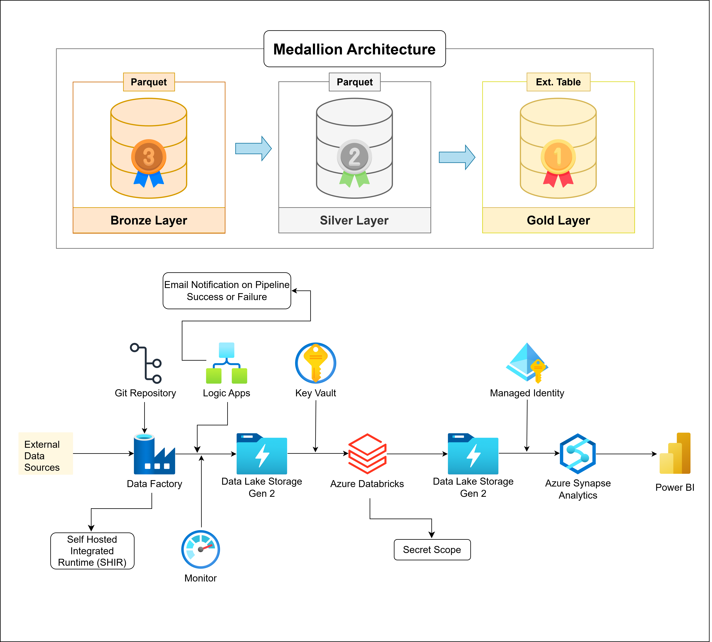

# 🏭 Adventure Works Data Engineering Pipeline (Azure | ADF | Databricks | Synapse)

## 📌 Overview

This project implements a **production-grade, end-to-end data engineering pipeline** using the **Adventure Works dataset** on Microsoft Azure. It follows the **Medallion Architecture (Bronze → Silver → Gold)** to ensure scalability, reliability, and high-quality data for analytics and reporting.

The pipeline ingests raw data from external sources, processes it through distributed computing (Databricks), and delivers **analytics-ready datasets** for business intelligence tools like Power BI.

---

## 🏗️ Architecture

---

## 🔄 End-to-End Data Flow

**External Sources → Azure Data Factory → Bronze (Raw) → Databricks → Silver (Cleaned) → Gold (Curated) → Synapse → Power BI**

---

## 📂 Data Source

* Dataset: **Adventure Works**
* Format: Parquet / Structured Data
* Source Type: External Data Sources
* Ingestion Method: Azure Data Factory Pipelines

---

## 🥉 Bronze Layer – Raw Data Ingestion

### 🔧 Tool: Azure Data Factory (ADF)

The Bronze layer is responsible for ingesting raw data into the data lake with minimal transformation.

### ✅ Key Features:

* Parameterized pipelines for flexible ingestion
* Integration with multiple external data sources
* Automated orchestration using ADF pipelines
* Support for **Self-Hosted Integration Runtime (SHIR)**

### 📋 Details:

* Format: Parquet
* Load Type: Batch Processing
* Write Mode: Append
* Transformations: None (raw ingestion)
* Storage: Azure Data Lake Storage Gen2

### 🎯 Purpose:

* Preserve raw, unmodified data
* Enable traceability and reprocessing
* Serve as a single source of truth

---

## 🥈 Silver Layer – Data Cleaning & Transformation

### 🔧 Tool: Azure Databricks (PySpark)

The Silver layer transforms raw Bronze data into clean, structured datasets.

### 🔄 Transformations Applied:

* Data cleansing (null handling, filtering invalid records)
* Schema enforcement & standardization
* Deduplication
* Data normalization
* Derived column creation
* Business rule application

### 📋 Details:

* Format: Parquet
* Load Type: Batch Processing
* Write Mode: Overwrite
* Data Model: Cleaned & structured tables

### 🎯 Purpose:

* Improve data quality and consistency
* Prepare data for downstream analytics
* Ensure standardized schemas across datasets

---

## 🥇 Gold Layer – Business & Analytics Layer

### 🔧 Tools: Databricks (SQL/PySpark) + Azure Synapse Analytics

The Gold layer delivers **business-ready, aggregated datasets** optimized for analytics and reporting.

### 🔄 Transformations Applied:

* Data aggregation (sales, revenue, orders, etc.)
* KPI calculations
* Joins across multiple domains (customers, products, sales)
* Business logic implementation

### 📊 Data Modeling:

* Star Schema (Fact & Dimension Tables)
* Denormalized tables for performance
* External Tables in Synapse for querying

### 📋 Details:

* Format: External Tables / Delta / Parquet
* Load Strategy: Derived from Silver
* Consumption Layer: Synapse + Power BI

### 🎯 Purpose:

* Enable fast querying and reporting
* Provide curated datasets for business users
* Support BI dashboards and analytics

---

## 📊 Data Consumption

### 🔧 Tools: Azure Synapse Analytics + Power BI

* Interactive dashboards
* Business reporting (sales trends, KPIs)
* Ad-hoc SQL queries
* Data exploration

---

## ⚙️ Technologies Used

* Azure Data Factory (ADF)
* Azure Data Lake Storage Gen2
* Azure Databricks
* Azure Synapse Analytics
* Power BI
* PySpark
* Parquet / Delta Lake

---

## 🔐 Security & Governance

### 🔑 Key Components:

* **Azure Key Vault**
  * Secure storage for secrets, credentials, and keys

* **Managed Identity**
  * Eliminates need for hardcoded credentials
  * Enables secure access between Azure services

* **Databricks Secret Scope**
  * Securely access secrets inside notebooks

### ✅ Best Practices Implemented:

* No hardcoded credentials
* Role-based access control (RBAC)
* Secure data access via managed identities
* Encryption at rest and in transit

---

## 🔔 Monitoring & Orchestration

### 🔧 Tools:

* Azure Data Factory Monitoring
* Logic Apps (Email Notifications)

### 📌 Features:

* Pipeline success/failure notifications via email
* Centralized monitoring of pipeline runs
* Logging and observability

---

## 🚀 Key Highlights

* End-to-end **Medallion Architecture implementation**
* Scalable and modular pipeline design
* Secure integration using **Managed Identity & Key Vault**
* Separation of concerns across data layers
* Production-ready orchestration with monitoring
* Integration with **Synapse + Power BI for analytics**

---

## 📈 Future Enhancements

* Implement **incremental (delta) loading**
* Introduce **Delta Lake in Silver & Gold layers**
* Add **CI/CD pipelines (Azure DevOps / GitHub Actions)**
* Enhance monitoring with **Azure Monitor & Log Analytics**
* Optimize cost with **auto-scaling clusters**
* Implement **data quality checks (Great Expectations / Deequ)**

---

## 💬 Conclusion

This project demonstrates how to build a **scalable, secure, and enterprise-grade data engineering pipeline** using Azure services. By leveraging Medallion Architecture, it ensures high data quality, maintainability, and performance for downstream analytics.

---

## 👨‍💻 Author

Mayur Swami
